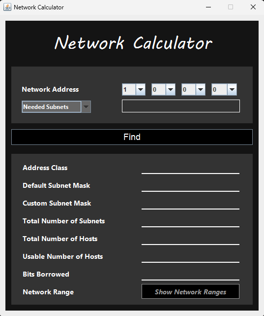
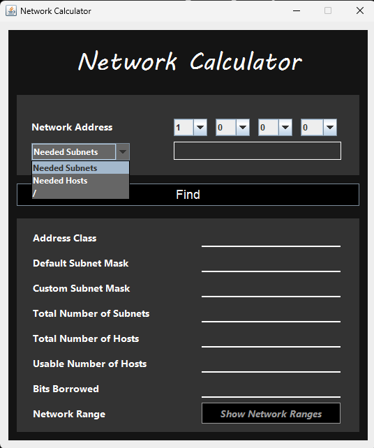
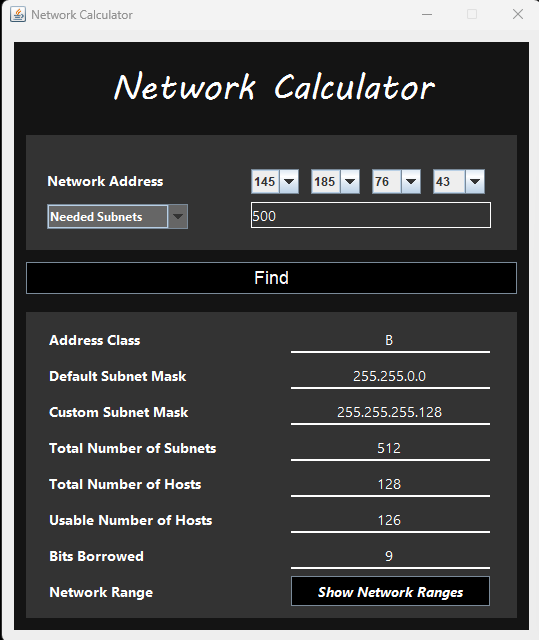
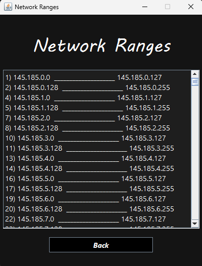
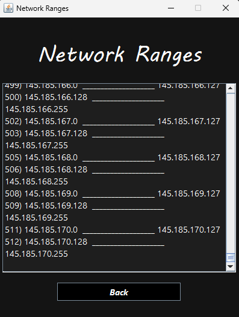

# IP Addressing Calculator

This project is a Java-based IP Addressing Calculator designed to handle both classful and classless IP addressing schemes. The application provides an intuitive GUI to simplify the process of calculating network ranges, subnets, and other relevant details.

## Features

- **Classful and Classless Addressing**: Supports both classful (A, B, C) and classless IP addressing.
- **Subnet Calculation**: Easily calculate the number of subnets and their ranges based on input requirements.
- **Custom Subnet Masks**: Customize subnet masks to suit specific network configurations.
- **User-Friendly GUI**: Attractive and easy-to-use interface developed using Java Swing.
  
## Technologies Used

- **Java**: Core programming language used to develop the application.
- **Swing**: Java's GUI widget toolkit used for building the graphical user interface.
- **Apache NetBeans IDE**: The integrated development environment used to build and test the application.

## Screenshots

### Network Calculator Interface




### Network Calculator Outputs



### Network Ranges




## Getting Started

### Prerequisites

- Java Development Kit (JDK) 11 or higher.
- Apache NetBeans IDE (or any preferred Java IDE).

### Installation

1. **Clone the repository**:
   ```bash
   git clone [https://github.com/mdhanush666/IP-Calculator-Project-JAVA.git]
   ```

2. **Open the project**: Open the project in NetBeans IDE or any other Java-supported IDE.
3. **Build and Run**: Build and run the project to start using the IP Addressing Calculator.

### Running the Application

1. **Enter the Network Address**: Input the desired network address in the provided fields.
2. **Select Calculation Type**: Choose whether to calculate based on the number of subnets or the number of hosts.
3. **Click Find**: The application will display the calculated results, including subnet mask, total subnets, total hosts, and more.
4. **View Network Ranges**: Click on "Show Network Ranges" to view the available network ranges.

## How It Works

1. **Network Address Input**: Users can input the starting network address.
2. **Subnet Calculation**: Users can choose to calculate based on the number of subnets or the number of hosts they require. The application will then calculate the necessary subnet mask, the number of bits borrowed, and other relevant details.
3. **Display Results**: The application provides all the necessary network details such as the address class, default subnet mask, custom subnet mask, total number of subnets, usable hosts per subnet, and the range of IP addresses.


## Contributing

Contributions are what make the open-source community such an amazing place to learn, inspire, and create. Any contributions you make are **greatly appreciated**.

If you have a suggestion that would make this better, please fork the repo and create a pull request. You can also simply open an issue with the tag "enhancement".

1. Fork the Project
2. Create your Feature Branch (`git checkout -b feature/AmazingFeature`)
3. Commit your Changes (`git commit -m 'Add some AmazingFeature'`)
4. Push to the Branch (`git push origin feature/AmazingFeature`)
5. Open a Pull Request

## License

Distributed under the MIT License. See `LICENSE` for more information.

## Contact

E-mail        - m.dhanush666dhanu@gmail.com

Project Link  - https://github.com/mdhanush666/IP-Calculator-Project-JAVA.git


